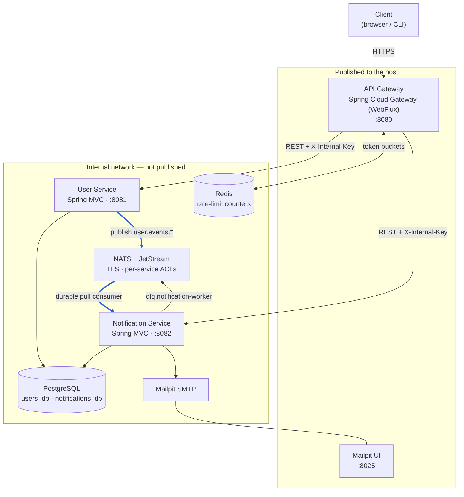
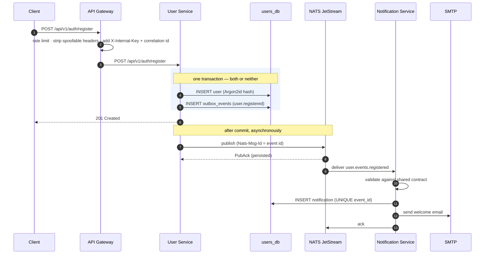

# TRAMS

An event-driven microservices system: an **API Gateway** fronting a **User Service** and a
**Notification Service** that communicate **asynchronously over NATS JetStream** — never
over REST or WebSockets.

Built with Java 25 and Spring Boot 4. Runs end to end with one command.

---

## Contents

- [What it does](#what-it-does)
- [Architecture](#architecture)
- [Quick start](#quick-start)
- [Verifying it works](#verifying-it-works)
- [API](#api)
- [How the requirements are met](#how-the-requirements-are-met)
- [Project layout](#project-layout)
- [Configuration](#configuration)
- [Testing](#testing)
- [Operating it](#operating-it)
- [Technology choices](#technology-choices)
- [Known limitations](#known-limitations)

---

## What it does

A user registers through the gateway. The **User Service** stores the account and, in the
*same database transaction*, records a `user.registered` event. A background relay
publishes that event to **NATS JetStream**. The **Notification Service** consumes it,
renders a welcome email and delivers it — with no synchronous call between the two services
in either direction.

The same pipeline carries profile updates, password changes and account deletions.

```
POST /api/v1/auth/register
        │
        ▼
┌─────────────────┐   same transaction   ┌──────────────┐
│  users table    │◄────────────────────►│ outbox_events│
└─────────────────┘                      └──────┬───────┘
                                                │ relay (FOR UPDATE SKIP LOCKED)
                                                ▼
                                    NATS JetStream (TLS + per-service ACLs)
                                                │  durable pull consumer
                                                ▼
                                      ┌───────────────────┐
                                      │ notifications     │  UNIQUE(event_id)
                                      └─────────┬─────────┘  → exactly-once effect
                                                ▼
                                          SMTP → Mailpit
```

---

## Architecture



The blue path is the **only** channel between the two services: `user.events.*` on
JetStream. Neither service holds an HTTP client for the other, and neither can reach the
other's database.

### Request and event flow



Full design rationale, failure analysis and trade-offs: **[docs/ARCHITECTURE.md](docs/ARCHITECTURE.md)**.

---

## Quick start

**Only Docker is required.** No Java, no Maven, no NATS or PostgreSQL install — the
images build themselves.

```bash
git clone https://github.com/HarshGupta1135/trams-microservices.git
cd trams-microservices
bash scripts/start.sh
```

On Windows, double-click **`start.cmd`** or run it from CMD/PowerShell — it finds Git
Bash or WSL for you.

That one command checks Docker is running, generates the secrets and TLS material,
builds and starts all seven containers, waits for every one to report healthy, creates
two demo accounts, and prints where to go next. First run takes a few minutes to compile
three Spring Boot applications; afterwards it is seconds.

Add `--verify` to run the 34-check end-to-end suite immediately after startup:

```bash
bash scripts/start.sh --verify
```

### Then open

| URL | What |
|---|---|
| **<http://localhost:8080/docs>** | **Start here** — Swagger UI, both services in one selector |
| <http://localhost:8025> | Mailpit — every notification the system delivered |
| <http://localhost:8080/actuator/health/readiness> | Gateway readiness |
| <http://localhost:8080> | The gateway root answers **401**, and should: every route is authenticated unless explicitly public, so there is no landing page |

### Log in

Two accounts are created for you:

| Email | Password | Roles |
|---|---|---|
| `demo@trams.local` | `demo-password-1234` | USER |
| `admin@trams.local` | `admin-password-1234` | ADMIN + USER |

In Swagger: `POST /api/v1/auth/login` → copy `accessToken` → click **Authorize** (top
right) → paste it. No `Bearer ` prefix; Swagger adds that. Or run `bash scripts/token.sh`
to print a fresh one (they last 15 minutes by design — stateless tokens cannot be revoked
before expiry, so the refresh token is the long-lived, revocable half).

### See the event pipeline in 30 seconds

Register any user through `POST /api/v1/auth/register`, then open
**<http://localhost:8025>**. The welcome email is already there, having travelled from a
database transaction through the outbox and NATS JetStream into the Notification Service —
with no REST or WebSocket call between the two services. `GET /api/v1/notifications/me`
shows the same event recorded as a notification.

### Running it manually

If you would rather not use the script:

```bash
bash scripts/generate-secrets.sh    # writes .env: RSA key pair + random passwords
bash scripts/generate-tls.sh        # writes infra/tls: CA + NATS server certificate
docker compose up -d --build
```

**Nothing in this repository contains a working credential.** Both scripts generate fresh
material locally, and `.env` is git-ignored. A checkout is not a set of usable keys.

### Stopping

```bash
docker compose down        # stop, keep data
docker compose down -v     # stop and delete the database and stream volumes
```

## Verifying it works

`scripts/smoke-test.sh` drives the system exclusively through the gateway and asserts:

```
1. Availability                     gateway readiness
2. Authentication                   anonymous → 401, forged token → 401, register,
                                    duplicate → 409, invalid payload → 400,
                                    login, /users/me, admin route → 403
3. Async event pipeline             a registration becomes a delivered notification
4. Token rotation                   rotation issues a new token; replaying a consumed
                                    one → 401 AND revokes the whole family
5. Further events                   profile update + password change produce notifications;
                                    the old password stops working
6. Correlation id handling          a valid id is honoured; a malformed one is replaced
7. HTTP error mapping               bad enum/path/content-type/method map to 400/415/405,
                                    not 500; page size capped; every error carries
                                    code + correlationId
8. Documentation endpoints          /docs, the UI bootstrap config, and both OpenAPI
                                    documents are actually served
9. Delivered mail                   Mailpit captured the messages
10. Rate limiting                   the auth endpoint returns 429 under a burst
```

Observed: **34 passed, 0 failed**, and re-runnable back-to-back — the rate-limit check
runs last, and the suite waits for the token bucket to refill before the auth sections, so
a second run does not fail on a bucket the first one drained.

To watch the pipeline live:

```bash
docker compose logs -f notification-service     # events arriving and being handled
docker compose logs -f user-service | grep -i outbox
```

Inspect broker state directly:

```bash
docker compose exec nats wget -qO- 'http://127.0.0.1:8222/jsz?streams=1&consumers=1'
```

---

## API

Interactive documentation is served by the gateway at **<http://localhost:8080/docs>**;
the full reference with request/response examples is in **[docs/API.md](docs/API.md)**.

| Method | Path | Auth | Purpose |
|---|---|---|---|
| `POST` | `/api/v1/auth/register` | — | Create an account (emits `user.registered`) |
| `POST` | `/api/v1/auth/login` | — | Exchange credentials for a token pair |
| `POST` | `/api/v1/auth/refresh` | — | Rotate the refresh token |
| `POST` | `/api/v1/auth/logout` | — | Revoke a refresh token |
| `GET` | `/api/v1/users/me` | Bearer | Own profile |
| `PATCH` | `/api/v1/users/me` | Bearer | Update profile (emits `user.profile_updated`) |
| `POST` | `/api/v1/users/me/change-password` | Bearer | Change password (emits `user.password_changed`) |
| `DELETE` | `/api/v1/users/me` | Bearer | Delete account (emits `user.deleted`) |
| `GET` | `/api/v1/users` | Bearer + ADMIN | List users (paged) |
| `GET` | `/api/v1/users/{id}` | Bearer + ADMIN | Fetch any user |
| `DELETE` | `/api/v1/users/{id}` | Bearer + ADMIN | Delete any user |
| `GET` | `/api/v1/notifications/me` | Bearer | Own notification history (paged) |
| `GET` | `/api/v1/notifications/me/{id}` | Bearer | One notification, with its body |

Errors use **RFC 9457 Problem Details**, extended with a stable `code` and the
`correlationId` that ties the response to server-side logs:

```json
{
  "type": "https://docs.trams.local/errors/validation-error",
  "title": "Bad Request",
  "status": 400,
  "detail": "The request payload is invalid.",
  "code": "VALIDATION_ERROR",
  "correlationId": "d0523025-1533-44d9-ab5c-237c12329be5",
  "errors": [{ "field": "email", "message": "must be a well-formed email address" }]
}
```

---

## How the requirements are met

| Requirement | Where | How |
|---|---|---|
| **No REST/WebSocket between services** | `common-messaging`, `common-contracts` | NATS JetStream on `user.events.*`. Neither service has an HTTP client or database grant for the other. |
| **Secure** | `infra/nats/nats-server.conf` | TLS with a private CA, plus **per-service credentials scoped by subject ACLs**: the producer may publish to `user.events.>` but not subscribe; the consumer may subscribe but not publish there. |
| **Reliable** | `OutboxEvent`, `OutboxRelay`, `NotificationStore` | **Transactional outbox** (event committed atomically with the change) → **broker deduplication** via `Nats-Msg-Id` → **idempotent consumer** via `UNIQUE(event_id)` → **backoff + dead-letter stream**. |
| **Asynchronous** | `AuthController`, `OutboxRelay` | The API responds as soon as the transaction commits; publication happens afterwards. A broker outage cannot fail a registration. |
| **Production-ready** | throughout | Graceful shutdown with consumer draining, liveness/readiness split, Prometheus metrics, structured JSON logs with correlation ids, connection-pool sizing, non-root containers, health-gated startup ordering. |
| **Clean, scalable architecture** | module layout | Hexagonal per service (`domain` / `application` / `infrastructure` / `web`); stateless services; `FOR UPDATE SKIP LOCKED` relay and a shared durable consumer both scale by adding replicas. |
| **Authentication & security** | `common-security`, `common-web`, gateway | RS256 JWT where **only the User Service holds the private key**; Argon2id passwords; refresh-token rotation with **theft detection**; distributed rate limiting; gateway-only admission; header sanitisation; security headers; CORS allow-list. |
| **Error handling & validation** | `DefaultExceptionHandler`, DTOs, `EventCodec` | Bean Validation on every DTO; RFC 9457 responses; internal details never leaked; events validated against the shared contract on the way in. |
| **Config in environment** | `.env.example`, `application.yaml` | Every secret is an env var with no default. Missing configuration fails startup rather than falling back. |

---

## Project layout

```
trams/
├── common-contracts/       The published event contract. Pure Java: envelope, sealed
│                           payload hierarchy, subject names. No framework code.
├── common-security/        Token settings + RSA key loading. No web framework, so both
│                           the servlet services and the reactive gateway can share it.
├── common-messaging/       NATS infrastructure: connection lifecycle, TLS, envelope
│                           codec, topology-as-code, publisher, durable consumer, DLQ.
├── common-web/             Servlet-side HTTP plumbing: correlation ids, gateway
│                           admission control, token verification, RFC 9457 errors.
├── user-service/           Identity. Owns users_db and the USER_EVENTS stream.
├── notification-service/   Consumes events, delivers notifications. Owns
│                           notifications_db and the DEAD_LETTER stream.
├── api-gateway/            The only public process. Routing, auth, rate limits,
│                           circuit breakers, aggregated docs.
├── infra/                  nats-server.conf (ACLs), Postgres init, generated TLS
├── scripts/                generate-secrets.sh · generate-tls.sh · smoke-test.sh
└── docs/                   ARCHITECTURE.md · API.md
```

Each service is internally layered so that the broker and the database are replaceable
details:

```
web/            HTTP adapters — controllers, DTOs, error mapping
application/    use cases — the transaction boundary lives here
domain/         entities and invariants; no Spring, no JPA queries
infrastructure/ adapters — repositories, outbox relay, consumers, senders
```

---

## Configuration

Every setting is an environment variable; see **[.env.example](.env.example)**, which
documents each one and why it exists. Highlights:

| Variable | Purpose |
|---|---|
| `JWT_PRIVATE_KEY_BASE64` | RS256 signing key — **supplied only to the User Service** |
| `JWT_PUBLIC_KEY_BASE64` | Verification key — supplied to every component |
| `INTERNAL_API_KEY` | Proves a request came through the gateway (min 32 chars) |
| `NATS_*_USER` / `_PASSWORD` | Per-service broker credentials, scoped by ACLs |
| `NATS_TLS_CA_FILE` | CA the services verify the broker against |
| `NOTIFICATION_CHANNEL` | `EMAIL` (SMTP) or `LOG` — run with no mail server at all |
| `RATE_LIMIT_*`, `AUTH_RATE_LIMIT_*` | Token-bucket rates; auth routes are far stricter |
| `CORS_ALLOWED_ORIGINS` | Explicit browser-origin allow-list |

PEM keys are base64-encoded because a PEM's line breaks cannot be represented in a dotenv
file or a Kubernetes environment variable.

---

## Testing

```bash
./mvnw test        # unit tests — fast, no Docker
./mvnw verify      # adds integration tests (Testcontainers; needs Docker)
```

**Unit tests** cover the logic worth protecting: the event-contract registry, the
serialisation boundary, the outbox retry state machine, refresh-token rotation, the
consumer's failure classification, and the anti-enumeration property of login.

**`EventFlowIT`** is the important one. It runs the Notification Service against a real
PostgreSQL and a real NATS broker and asserts the three properties that cannot be verified
with mocks:

1. an event published to the broker becomes a delivered notification;
2. **redelivering the same event produces exactly one notification** — at-least-once
   delivery turned into exactly-once effect;
3. an event of an unknown type is **dead-lettered rather than retried**.

Unit tests run under Surefire; `*IT` classes run under Failsafe on `verify`, because they
need a Docker daemon.

---

## Operating it

**Health.** Liveness and readiness are deliberately different. `/actuator/health/liveness`
checks nothing external — restarting a process cannot fix someone else's outage, and a
restart loop across every replica turns a recoverable blip into a self-inflicted one.
`/actuator/health/readiness` does check the database and broker, so an unhealthy replica
stops taking traffic while staying alive.

**Metrics** at `/actuator/prometheus` on each service. The ones that matter:

| Metric | Why it matters |
|---|---|
| `trams_outbox_pending` | Growing = events are being delayed even though the API looks fine |
| `trams_outbox_oldest_pending_age_seconds` | Backlog *age* — the real signal for alerting |
| `trams_outbox_failed` | Events that exhausted their retries and need a human |
| `trams_notifications_duplicates_skipped` | Non-zero is healthy: the idempotency guard working |
| `dead_lettered_messages_total` | Unprocessable events, labelled by reason |

**Logs** are single-line JSON in the `docker` profile, human-readable otherwise, and every
line carries the `correlationId` — so one identifier follows a request from the gateway,
through both services, and into the events they publish:

```bash
docker compose logs | grep 'my-correlation-id'
```

**Scaling.** All three services are stateless. `docker compose up -d --scale notification-service=3`
works because every replica binds to the *same* durable consumer and JetStream distributes
messages between them; the outbox relay claims rows with `FOR UPDATE SKIP LOCKED`, so
replicas take disjoint batches with no coordination.

---

## Technology choices

Versions were verified against Maven Central rather than recalled.

| Component | Version | Note |
|---|---|---|
| Java | 25 (LTS) | Virtual threads enabled; records and sealed types used throughout |
| Spring Boot | **4.0.8** | Pinned to match the Spring Cloud train — see below |
| Spring Cloud | 2025.1.3 | Latest GA train; pins Boot 4.0.8 and Gateway 5.0.3 |
| Spring Cloud Gateway | 5.0.3 | `spring-cloud-starter-gateway-server-webflux` |
| NATS client | jnats 2.26.2 | Official client; JetStream via the simplified consumer API |
| PostgreSQL | 18 | One instance, one database and role per service |
| Flyway | 11.14.1 | Boot-managed version; schema is never generated by Hibernate |
| Jackson | 3.x | Boot 4 ships Jackson 3 (`tools.jackson.*`) |

**Why Boot 4.0.8 and not the newer 4.1.x:** Spring Cloud `2025.1.3` is the latest GA
release train and explicitly pins `spring-boot.version = 4.0.8`. Running 4.1.x against it
would be unsupported version skew for the single most important component in the system.
Being one minor behind inside the supported matrix is the better trade.

---

## Known limitations

Stated plainly, because a reviewer will find them anyway:

- **NATS uses TLS with username/password, not mutual TLS.** The server is authenticated and
  traffic is encrypted, but clients present no certificate. In a cluster the next step is
  `verify: true` with per-service client certificates, or NKEY/JWT accounts.
- **Gateway→service trust is a shared secret.** Adequate here because the services are
  never published, and it is defence in depth rather than the only control — but in a
  cluster this is the layer you would replace with a service mesh identity.
- **The outbox relay holds row locks across the publish round-trip.** That is what prevents
  two replicas shipping the same row; the batch size and publish timeout are kept small to
  bound how long a lock can be held.
- **Delivery is at-least-once with exactly-once *effect*.** A crash between sending an email
  and marking the row `SENT` can produce a duplicate email. The alternative — holding a
  database transaction open across an SMTP conversation — is worse.
- **Global event ordering is not guaranteed** when several relay replicas run concurrently.
  Consumers are written to be idempotent and order-independent rather than relying on it.
- **No distributed tracing backend.** Correlation ids are propagated end to end and
  Micrometer is wired up, but there is no Jaeger/Tempo exporter configured.
