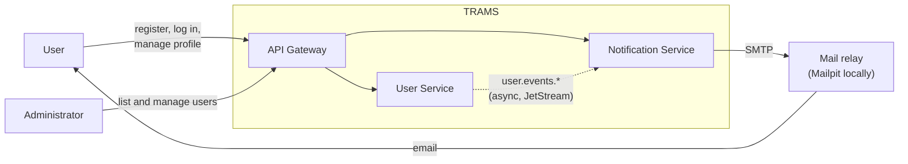
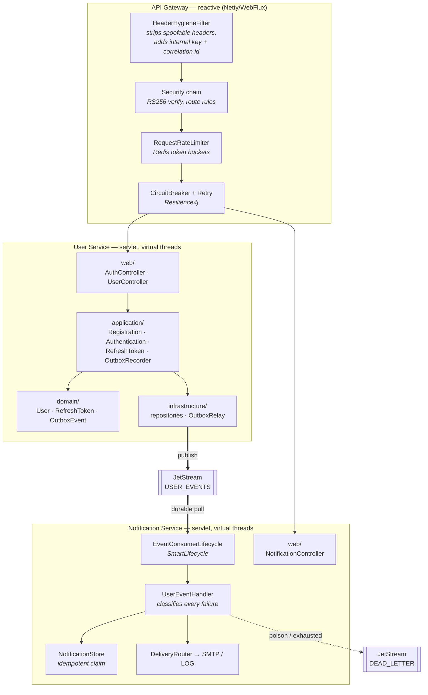
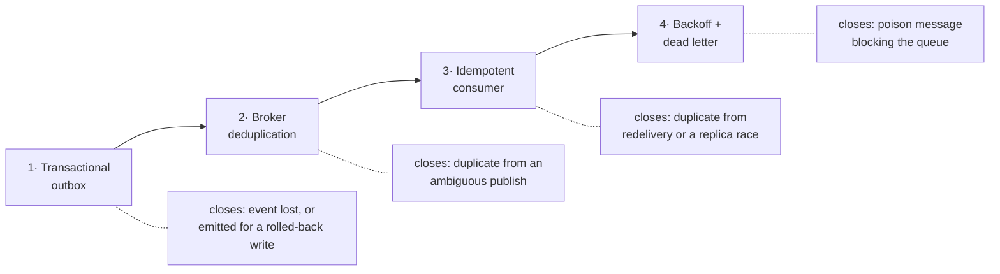
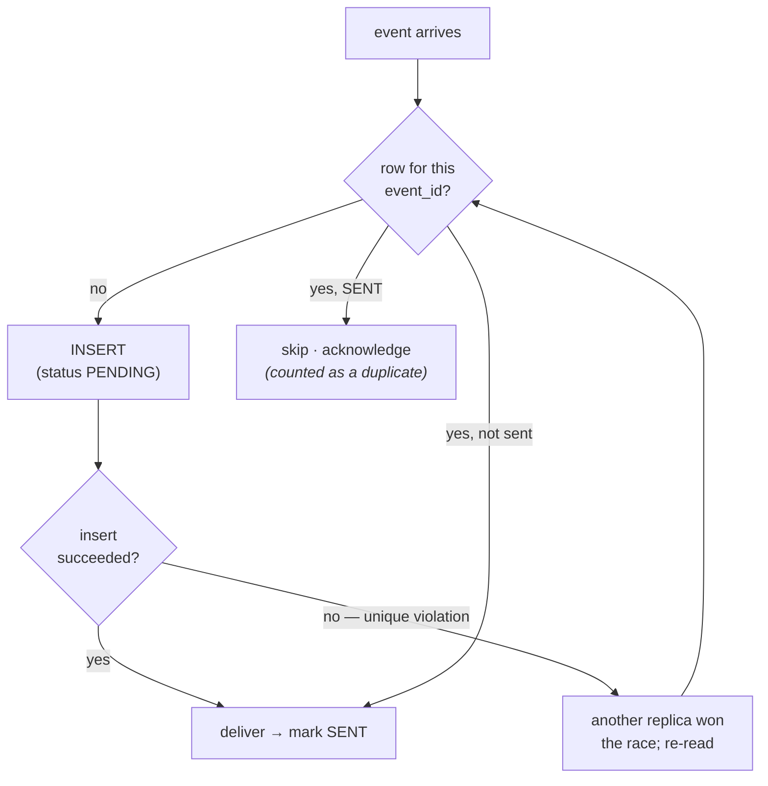
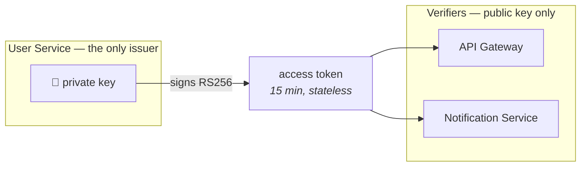
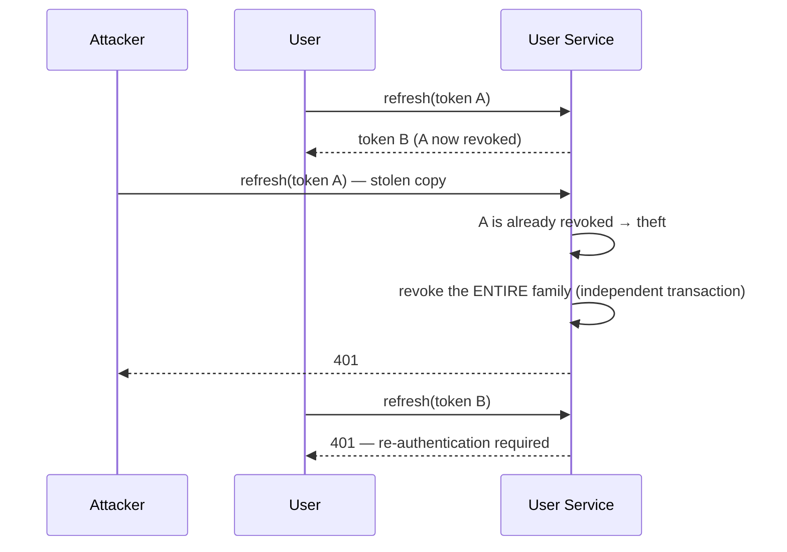
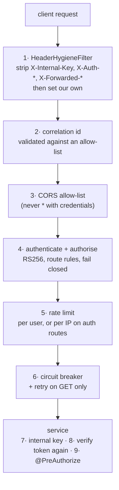
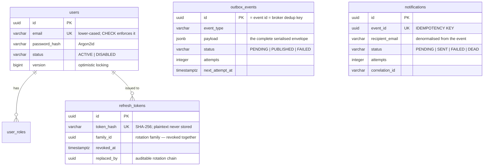

# Architecture

This document explains **why** the system is shaped the way it is. For setup and usage see
the [README](../README.md); for endpoint details see [API.md](API.md).

## Contents

- [System context](#system-context)
- [Component view](#component-view)
- [The rule that shapes everything: no REST between services](#the-rule-that-shapes-everything-no-rest-between-services)
- [Reliable delivery](#reliable-delivery)
- [Security](#security)
- [Scalability](#scalability)
- [Failure analysis](#failure-analysis)
- [Data model](#data-model)
- [Decisions and trade-offs](#decisions-and-trade-offs)
- [What I would do next](#what-i-would-do-next)

---

## System context



The dotted line is the only coupling between the two services, and it is asynchronous. The
User Service does not know the Notification Service exists; it publishes facts about users
and is finished.

---

## Component view



---

## The rule that shapes everything: no REST between services

The requirement is that the two services must not call each other over REST or WebSockets.
Meeting that literally is easy; meeting it *well* means the services must not *want* to call
each other. Two decisions make that true.

**Events carry everything a consumer needs.** Every `UserEventPayload` includes the user's
id, email address and name — not just an id. If it carried only an id, the Notification
Service would have to fetch the address to send an email, and the ban on REST would have
been satisfied in letter while the coupling remained. Denormalising the recipient into the
event is also more correct: a notification is a record of what was sent to which address at
the time, and must not change retroactively when the user later edits their profile.

**Neither service can reach the other's data.** Each has its own database, its own role, and
`CONNECT` is revoked from `PUBLIC`, so the Notification Service physically cannot read the
users table. Without that, a well-meaning change would eventually add a convenient JOIN and
the two services would be permanently welded together.

The contract itself lives in `common-contracts` as a **sealed interface**:

```java
public sealed interface UserEventPayload
        permits UserRegistered, UserProfileUpdated, UserPasswordChanged, UserDeleted { ... }
```

The consumer then dispatches with an exhaustive `switch` and **no `default` branch**. Adding
an event type makes `NotificationComposer` fail to compile until the new event is given a
message — so a new event can never silently produce no notification. That is the value of
sharing the contract, and the reason `common-contracts` deliberately contains nothing else:
a shared library that grows past the wire contract is how a set of microservices quietly
becomes a distributed monolith.

---

## Reliable delivery

"Reliable" is not one mechanism but a chain, and each link closes a specific hole.



### 1. Transactional outbox — the event cannot disagree with the data

The naive approach is to write the user, then publish. Between those two steps the process
can die, and the account exists with no event: a user who never receives a welcome email and
no record of why. Publishing first is worse — an event for a transaction that then rolls
back.

So the event is written to `outbox_events` **in the same transaction** as the user row:

```java
@Transactional
public User register(...) {
    users.saveAndFlush(user);           // the domain change
    outbox.record(new UserRegistered(...), now);  // the event announcing it
}                                        // both commit, or neither does
```

`OutboxRecorder` is annotated `@Transactional(propagation = MANDATORY)`, so calling it
outside a transaction is a startup-visible error rather than a subtle atomicity bug found in
production.

A broker outage therefore cannot fail a registration. It only delays the notification.

### 2. Broker deduplication — a safe retry

`OutboxRelay` publishes with the event id as JetStream's `Nats-Msg-Id`. If the relay dies
after the broker stored the message but before the row was marked published, the next poll
republishes — and the stream's duplicate window collapses it. That is what makes the relay
free to retry without inventing duplicates.

### 3. Idempotent consumer — the important one

Deduplication windows expire, and JetStream guarantees only *at-least-once* delivery: a
consumer that crashes after sending an email but before acknowledging **will** see the event
again. Preventing redelivery is not possible in a distributed system, so the consumer is
built to tolerate it.

`notifications.event_id` carries a `UNIQUE` constraint, and the database is the arbiter:



Note the deliberate choice **not** to use a separate `processed_events` marker table. With a
marker, a crash between "mark processed" and "send" would make the event look handled while
no notification was ever delivered. Making the notification row *itself* the idempotency
record means its `status` says how far the work got, so a redelivery resumes rather than
skips.

The result is **exactly-once effect on at-least-once delivery** — verified by `EventFlowIT`,
which publishes the same envelope twice with different broker message ids (bypassing
deduplication so the consumer's own guard is what has to hold) and asserts exactly one
notification with exactly one delivery attempt.

### 4. Backoff and dead-lettering — a poison message cannot block the queue

Failures are classified, because the two classes demand opposite responses:

| Class | Examples | Response |
|---|---|---|
| **Transient** | broker unreachable, SMTP timeout, database restarting | `nak` → redelivered on a doubling backoff ladder |
| **Permanent** | payload fails contract validation, unknown event type, malformed JSON | `term` immediately + copied to `DEAD_LETTER` |

Unclassified exceptions are treated as **transient** deliberately: retrying a genuinely
permanent failure merely delays the dead letter by the delivery budget, whereas discarding a
genuinely transient one loses the event for good.

JetStream stops redelivering after `max_deliver`, but it does not keep the message anywhere
a human can find it. So on the final attempt the consumer explicitly copies the original
bytes to `dlq.notification-worker` with the reason, origin subject and delivery count —
turning a silent drop into an auditable, replayable record.

A handler that legitimately outlives `ack_wait` (a slow SMTP conversation) sends periodic
`inProgress()` heartbeats, so its message is not redelivered while it is still being
processed.

---

## Security

### Token architecture



**RS256 rather than a shared HMAC secret.** With HMAC, every component able to *verify* a
token is also able to *forge* one. Here only the User Service holds the private key, so
compromising the gateway or the Notification Service yields the ability to read traffic,
never to mint an identity. The private key is supplied to exactly one container in
`docker-compose.yml`.

Verification pins the algorithm explicitly:

```java
NimbusJwtDecoder.withPublicKey(publicKey).signatureAlgorithm(SignatureAlgorithm.RS256)
```

Leaving it open is the classic JWT vulnerability — a decoder that honours the `alg` header
can be induced to verify an attacker-signed HMAC using the public key as the shared secret,
or to accept `alg: none`. Issuer, audience, expiry and a `typ: access` claim are all
validated; skipping the audience check would let a token minted for another API that trusts
the same key be replayed here.

**Access tokens are short-lived and stateless; refresh tokens are long-lived and revocable.**
That split is the point: a stateless token cannot be revoked before it expires, so the
revocable half is the one that lives a long time.

### Refresh-token rotation with theft detection

Refresh tokens are opaque 256-bit random values — not JWTs — and only their SHA-256 hash is
stored, so a database disclosure yields no usable credentials. (SHA-256 rather than Argon2 is
correct here: the input is already 256 bits of entropy and cannot be brute-forced, so a slow
KDF would add latency on every refresh while adding no security.)

Each refresh **consumes** the presented token and issues a successor in the same *family*,
so a token is valid exactly once. Presenting a consumed token again therefore has only two
explanations — replay of a stolen token, or a client bug:



Since we cannot tell the attacker's copy from the legitimate one, the whole family is
revoked and both parties must re-authenticate. Without this step a stolen refresh token
would grant indefinite parallel access that the real user would never notice.

> **A bug worth recording.** The first implementation revoked the family and then threw
> `InvalidRefreshTokenException` from the *same* `@Transactional` method — so the rollback
> triggered by that exception silently undid the revocation. The system reported the attack
> and discarded its own defence, and a unit test asserting only the 401 would never have
> caught it. It was found by testing the running stack: replay returned 401, but the rotated
> token still worked. The fix is `TokenRevocationService`, whose methods run with
> `REQUIRES_NEW` so the revocation commits independently of the caller's rollback — in a
> separate bean, because Spring's transaction proxy is bypassed by self-invocation. The same
> flaw applied to the disabled-account path and was fixed with it.

### Defence in depth at the edge



A few of these deserve a word:

- **Header stripping is the trust boundary.** Anything a service treats as privileged is
  removed from the inbound request before the gateway sets its own value. Without it a
  client could send `X-Internal-Key` itself, or forge `X-Forwarded-For` to poison audit
  records and evade IP-based rate limiting. Headers are *set*, never merely added — HTTP
  headers are multi-valued, so adding would leave the service to choose.
- **The correlation id is validated, not trusted.** It is reflected in a response header and
  written into structured logs, so accepting arbitrary input would permit header injection
  and log forging.
- **Rate-limit keys differ by route.** Authenticated routes key on the user id, so one noisy
  client cannot exhaust the budget of everyone behind a shared NAT; auth routes key on IP,
  because there is no user id yet and those are the endpoints attacked with credential
  stuffing. Counters live in **Redis**, not memory, because N replicas with local counters
  would silently permit N times the intended rate.
- **Retries are restricted to `GET`.** Replaying a `POST /register` could duplicate an
  account.
- **Services verify the token again themselves.** The edge check is an optimisation and a
  first line of defence; the authoritative check is in the service. Identity is always taken
  from the verified `sub` claim, never from a header the gateway asserted — which removes a
  whole class of confused-deputy risk.

### Broker authorisation

`infra/nats/nats-server.conf` grants each service only what its role requires:

| | publish | subscribe |
|---|---|---|
| **User Service** | `user.events.>`, create/update `USER_EVENTS` | `_INBOX.>` only |
| **Notification Service** | `dlq.>`, own `DEAD_LETTER`, manage its own consumer, `$JS.ACK.USER_EVENTS.>` | `_INBOX.>` only |

The producer cannot read the event history it writes; the consumer cannot forge an event or
reconfigure the producer's stream. A stolen credential is bounded by the role it was issued
for.

### Other measures

- **Argon2id** password hashing (memory-hard, so GPUs and ASICs gain far less than against
  bcrypt), wrapped in a `DelegatingPasswordEncoder` so every hash records the algorithm that
  produced it — which is what makes a future migration possible without a flag day.
- **No account enumeration.** An unknown email and a wrong password return an identical
  response, *and* the unknown-email path still performs a hash comparison against a dummy
  hash. Returning early would make it measurably faster and turn response time into an
  enumeration oracle, defeating the identical message. Account status is checked only after
  the password is verified, for the same reason.
- **404, not 403, for another user's notification.** Returning 403 would confirm the id is
  real, letting an attacker enumerate identifiers and infer other users' activity.
- **Non-root containers**, `MaxRAMPercentage`, `ExitOnOutOfMemoryError`, no server version
  header, and a `default-src 'none'` CSP on these JSON APIs.

### Error mapping

Every service extends Spring's `ResponseEntityExceptionHandler` rather than declaring a
bare `@ExceptionHandler(Exception.class)`.

> **A second bug worth recording.** The first implementation used a plain catch-all advice.
> It worked for domain errors, but it also intercepted every failure Spring MVC maps
> correctly on its own — so an unparseable enum in a query string, a non-UUID path variable
> and an unsupported `Content-Type` were all reported as **500**. That is not cosmetic: a
> 500 means "this service is broken" and should wake somebody, while a malformed query
> parameter should not. Misreporting one as the other corrupts alerting, error budgets and
> client retry behaviour together. Extending the base class fixed all three at once, plus
> cases not yet thought of (405, 406), and `handleExceptionInternal` is overridden so a
> framework-produced problem document carries the same `code` and `correlationId` as a
> domain one. The smoke test now asserts each mapping so they cannot regress.

---

## Scalability

Every component is stateless; all session state is either in the token or in Postgres.

**The gateway** scales freely because rate-limit state is in Redis.

**The User Service** scales because the outbox relay claims work with

```sql
SELECT * FROM outbox_events
 WHERE status = 'PENDING' AND next_attempt_at <= now()
 ORDER BY created_at LIMIT :batch
 FOR UPDATE SKIP LOCKED
```

`SKIP LOCKED` is what makes this safe: rows held by one instance are stepped over by
another, so replicas process disjoint batches with no leader election and no possibility of
two relays publishing the same row.

**The Notification Service** scales because every replica binds to the *same* durable
consumer, so JetStream distributes messages between them. `max_ack_pending` supplies
back-pressure, so a struggling replica stops being handed work rather than collapsing.
Within a process, `concurrency` opens several independent bindings.

```bash
docker compose up -d --scale notification-service=3
```

Java 25 **virtual threads** are enabled on both services: request and event handling are
dominated by database and SMTP I/O, so unmounting a carrier thread while blocked lets a
small pool absorb far more concurrent work than thread-per-request.

Connection pools are sized **per replica**, not per cluster — Postgres serves a bounded
number of backends, so the pool must be `max_connections / replicas` with headroom.

---

## Failure analysis

| Failure | Effect | Recovery |
|---|---|---|
| **Broker down** | Registrations keep succeeding. Events accumulate in the outbox; `trams_outbox_pending` and the backlog-age gauge rise. | The relay drains the backlog on reconnect. Nothing is lost. |
| **Notification Service down** | Events accumulate in JetStream (durable, file-backed). | On restart the durable consumer resumes from its last acknowledged position. |
| **User Service down** | No new registrations. Already-published events are still consumed and delivered. | Restart; the gateway's circuit breaker returns 503 with `Retry-After` meanwhile. |
| **Database down** | Readiness fails, so the replica leaves the load balancer; liveness passes, so it is not killed. | Reconnects when the database returns. |
| **Mail relay down** | Delivery fails transiently; events are redelivered with backoff, then dead-lettered after 5 attempts with the notification marked `DEAD`. | Fix the relay, then replay from `DEAD_LETTER`. |
| **Poison event** | Terminated immediately and copied to `DEAD_LETTER`; the queue behind it is unaffected. | Fix the producer or consumer, then replay. |
| **Duplicate delivery** | The unique `event_id` makes the second one a no-op; `trams_notifications_duplicates_skipped` increments. | None needed — this is the design working. |
| **Two replicas race the same event** | One insert wins; the loser catches the unique violation and converges. | None needed. |
| **Redis down** | The gateway's readiness fails (it cannot make a rate-limit decision). | Reconnects; consider a fail-open policy if availability matters more than the limit. |

Startup ordering is handled rather than assumed: Compose gates the services on healthy
Postgres and NATS, and the Notification Service additionally **waits with backoff** for the
`USER_EVENTS` stream, because orchestrators start services concurrently and booting before
the producer has created the stream is the normal case, not an error.

---

## Data model

Two databases, one per service, in one PostgreSQL instance with separate roles and no
cross-database `CONNECT`.



Two details carry weight. `outbox_events.payload` holds the **complete serialised envelope**,
so the relay ships bytes and records the outcome without any domain knowledge — adding an
event type never requires touching it. And `notifications.event_id` is `UNIQUE`, which is
the whole idempotency guarantee expressed as a constraint the database enforces rather than
logic the application hopes to get right.

Flyway owns the schema and Hibernate runs with `ddl-auto: validate`. Letting Hibernate
generate DDL would make the live schema a side effect of entity code, with no review and no
rollback. Validation earns its keep: it caught a real mismatch during development, where a
migration declared `char(64)` while the entity mapped `varchar(64)`.

---

## Decisions and trade-offs

**Five modules, not one shared library.** `common-contracts` is the wire contract and holds
no framework code. `common-security` holds token settings and key loading with *no web
framework* — necessary because the two services are servlet applications while the gateway
is reactive, and a shared module pulling in `spring-boot-starter-web` would make Spring Boot
try to start a servlet container inside the gateway. `common-messaging` and `common-web` are
infrastructure both services need identically. The alternative — duplicating ~400 lines of
connection, TLS and error-rendering code — is worse, because a security setting that is
correct in one service and quietly missing in the other is invisible in review.

**A gateway that authenticates, rather than a pass-through.** Rejecting a bad token at the
edge means it never touches a service, opens a database connection, or consumes a thread
downstream. The services verify again anyway, so this is optimisation plus defence in depth,
not a single point of trust.

**WebFlux for the gateway, servlet for the services.** Proxying is almost entirely I/O-bound,
so a non-blocking pipeline holds far more concurrent connections per replica. The services
do transactional JDBC work, where the servlet model plus virtual threads is simpler and
loses nothing.

**Mailpit as the local channel, behind a port.** `NotificationSender` is an interface with
SMTP and log implementations, so the transport is swappable and the event pipeline can be
demonstrated with no mail server at all (`NOTIFICATION_CHANNEL=LOG`).

**Trade-offs accepted, with reasons:**

| Choice | Cost | Why anyway |
|---|---|---|
| Relay holds row locks during publish | A slow broker delays a batch | It is what prevents two replicas publishing the same row; batch size and timeout bound the exposure |
| Delivery outside the transaction | A crash after sending may duplicate an email | Holding a DB transaction across an SMTP conversation would pin connections to a third party's latency |
| At-least-once + idempotency, not exactly-once delivery | Consumers must be idempotent | Exactly-once delivery is not achievable across a network; exactly-once *effect* is, and this is how |
| Recipient denormalised into the event | Stale if the user later renames | A notification must record what was sent at the time; and it removes the need to call back |
| Shared secret for gateway→service | Not cryptographic identity | Services are unpublished; this is a second control, and the natural upgrade is a service mesh |

---

## What I would do next

In rough priority order:

1. **Mutual TLS for NATS** (`verify: true` with per-service client certificates), and NKEY
   or JWT accounts instead of passwords.
2. **A dead-letter replay tool** — the messages are preserved with full context, but
   replaying them is currently a manual `nats` CLI exercise.
3. **Distributed tracing export.** Correlation ids already flow end to end and Micrometer is
   wired; this is adding an OTLP exporter and a collector.
4. **Email verification and password reset**, both of which fit the existing event pipeline
   without new infrastructure.
5. **Schema registry or contract tests** between producer and consumer. The sealed interface
   gives compile-time safety *within* this repository; once services are released
   independently, that guarantee needs to become a published, versioned schema.
6. **Kubernetes manifests** with an HPA driven by `trams_outbox_pending` and consumer lag,
   which are the metrics that actually indicate saturation here.
